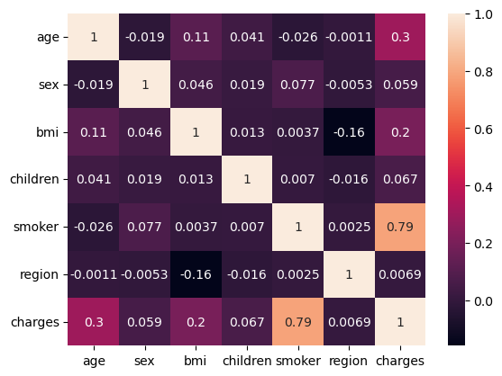

# EDA Insurance Data Analysis

## Problem Statement: 
An insurance agency, ABC Insurance, has a large dataset containing information about their policyholders and claims. They want to perform exploratory data analysis (EDA) on this dataset to gain insights that can help them make better business decisions and improve their operations. 

The agency wants to analyze the different body types and the environment that affect the premium. The disease's effect or the cost of treatment differs depending on the circumstances. For example, a smoker's medical insurance premium may be higher than that of a healthy person, because smokers are more likely to develop chronic diseases. The agency wants to analyze the data to research healthcare premium costs.

## Objective:
- To analyze the dataset that will help to create a model that will predict the cost of medical insurance based on various input features

**Domain**: Healthcare

**Dataset**: insurance dataset (insurance.csv)

## 1. Data Collection

### Dataset Description:

|**age**|	Age of the person|
|---|---|
|**sex**|	Female or Male|
|**BMI**|	BMI value to estimate an individual's health and fitness condition|
|**children**|	number of children (1,2,3,4, or 5)|
|**smoker**|	The person is a smoker or not|
|**region**|	Specifies the region (northeast, northwest, southeast, southwest)|
|**charges**|	the amount of insurance|

## 2. Data Exploration

Explore the data and find the insights from the data.

### Observations of the correlation matrix:

Correlation with charges (target variable):
- **smoker**:
    - Correlation = 0.787
    - This is a very strong positive correlation, indicating that smoking status has a significant impact on insurance charges. Smokers are likely to incur higher medical costs.
- **age**:
    - Correlation = 0.298
    - There is a moderate positive correlation between age and charges. Older individuals tend to have higher insurance premiums, possibly due to increased health risks with age.
- **bmi**:
    - Correlation = 0.198
    -There is a weak positive correlation between BMI and charges. Higher BMI (which can be associated with obesity) might lead to higher medical expenses.
- **children**, **sex**, **region**:
    - here are the remaining variables where the correlation is very weak (close to 0), suggesting that these variables have little to no linear impact on charges.

## 3. Final Observations

- **Premium Charges**
  - Across all age categories, smoking significantly raises insurance costs. The premiums paid by smokers are consistently greater than those of non-smokers.

- **Age Factor**
  - Because older age is associated with a higher risk, insurance rates rise with age for both smokers and non-smokers.
  - As people age, smoking increases the risk factors that insurers take into account, as evidenced by the growing disparity in rates between smokers and non-smokers.

- **Significant Difference in Premium Charges for Smokers and Non-Smokers**
  - The analysis highlights the strong influence of smoking on insurance premiums, suggesting that quitting smoking could result in lower premiums.